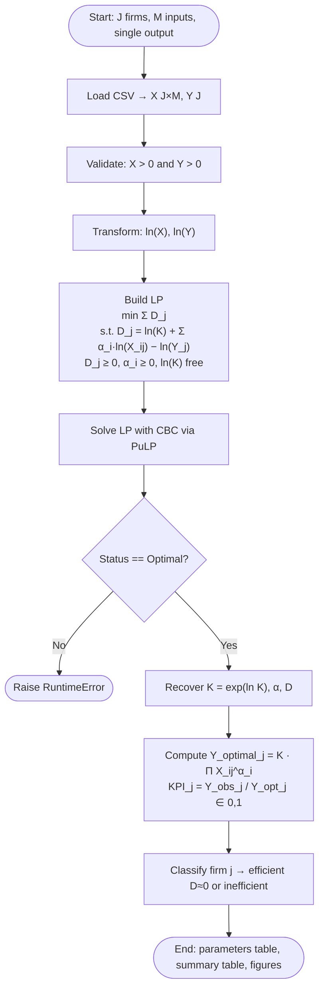

# Efficiency Analysis Project

Introduction to Optimization (Spring 2026) — Performance Evaluation Homework.
Implements the Cobb–Douglas production frontier introduced by
Prof. Alireza Amirteimoori in the lecture of 7 May 2026.

## Problem

Given `J` firms, each consuming `M` inputs to produce a single output, we want
to assign an efficiency score to every firm. The unknown production function
is assumed to follow the Cobb–Douglas form

```
Y_optimal_j = K · X1j^α1 · X2j^α2 · … · XMj^αM
```

with `Y_observed_j ≤ Y_optimal_j` for all firms. Taking the natural logarithm
of both sides and introducing a non-negative slack `D_j` linearises the model:

```
ln(Y_observed_j) + D_j = ln(K) + Σ_i α_i · ln(X_ij)
```

The parameters `(K, α_1, …, α_M)` are estimated by solving the LP:

```
min   Σ_j D_j
s.t.  D_j = ln(K) + Σ_i α_i · ln(X_ij) − ln(Y_observed_j)    ∀ j
      D_j ≥ 0,   α_i ≥ 0,   ln(K) free
```

A firm is **efficient** when `D_j ≈ 0` and **inefficient** when `D_j > 0`.
The relative efficiency (KPI) is `Y_observed_j / Y_optimal_j ∈ (0, 1]`.

## Project layout

```
Efficiency_Analysis_Project/
├── README.md
├── requirements.txt
├── .gitignore
├── main.py                          # CLI entry point
├── src/
│   ├── __init__.py
│   ├── data_loader.py               # CSV → numpy arrays
│   └── efficiency_model.py          # LP formulation + result post-processing
├── scripts/
│   ├── generate_synthetic_data.py   # Reproducible synthetic-data generator
│   ├── visualize_results.py         # Frontier scatter + per-firm KPI bars
│   └── draw_flowchart.py            # LP-pipeline flowchart (PNG)
├── data/
│   ├── lecture_example.csv          # 6-firm validation set (see Validation)
│   └── synthetic_dataset.csv        # 20-firm AI-generated dataset
├── figures/                         # written by visualize_results.py / draw_flowchart.py
└── output/                          # written by `python main.py --save`
```

## Pipeline flowchart

Per the lecturer's request (14 May 2026: *"draw a flow chart, then write the
code"*), the implementation pipeline is summarised below. A PNG version
suitable for the submission is rendered to `figures/pipeline_flowchart.png`
by `python scripts/draw_flowchart.py`.



## Setup

```bash
python -m venv .venv
.venv\Scripts\activate          # PowerShell:  .venv\Scripts\Activate.ps1
pip install -r requirements.txt
```

Dependencies: [PuLP](https://github.com/coin-or/pulp) (bundles the open-source
CBC solver), NumPy, pandas, matplotlib (for the figures and the flowchart).

## Usage

Run on the bundled lecture example (validation):

```bash
python main.py
```

Run on the synthetic dataset and persist results to `output/`:

```bash
python main.py --dataset data/synthetic_dataset.csv --save
```

Regenerate the synthetic dataset from scratch (seed-controlled, reproducible):

```bash
python scripts/generate_synthetic_data.py
```

Render figures (efficiency frontier + per-firm KPI bars) for a dataset:

```bash
python scripts/visualize_results.py --dataset data/lecture_example.csv
python scripts/visualize_results.py --dataset data/synthetic_dataset.csv
```

Render the pipeline flowchart:

```bash
python scripts/draw_flowchart.py
```

### Expected CSV schema

| column        | type    | notes                                   |
|---------------|---------|-----------------------------------------|
| `firm_id`     | str/int | unique identifier per row               |
| `X1`, `X2`, … | float   | inputs, strictly positive               |
| `Y_observed`  | float   | output, strictly positive               |

All values must be `> 0` because the model takes natural logarithms.

## Datasets

### `data/lecture_example.csv` — validation set (6 firms, 2 inputs)

A small reconstruction of the example Prof. Amirteimoori solved in class on
7 May 2026. The exact input/output table from the lecture PDF
(`Int. Opt. Efficiency analysis.pdf`, pages 13–18) is embedded as an image,
so the values were back-constructed to match the stated optimum
(`K = 1, α₁ = 0.5, α₂ = 1` with firms 1, 2, 4, 5 efficient and 3, 6
inefficient). Used **only** to confirm that the LP implementation reproduces
the lecture solution.

| parameter | expected | computed |
|-----------|---------:|---------:|
| K         | 1        | 1.0000   |
| α(X1)     | 0.5      | 0.5000   |
| α(X2)     | 1        | 1.0000   |

### `data/synthetic_dataset.csv` — AI-generated dataset (20 firms, 2 inputs)

Because no real-world dataset was available at the time of writing, the
analysis dataset was generated synthetically by
`scripts/generate_synthetic_data.py`. The generator:

- fixes a random seed (`SEED = 42`) so results are reproducible;
- samples inputs uniformly in `[5, 50]` and rounds them to 2 decimals;
- applies a known Cobb–Douglas frontier (`K = 2`, `α = (0.4, 0.6)`);
- marks 50 % of the firms as efficient and applies a random efficiency
  factor in `[0.55, 0.95]` to the rest.

Running the model on this dataset recovers the ground-truth parameters
(`K ≈ 2.0000, α ≈ (0.4000, 0.6000)`) and correctly identifies the 10
designed-efficient firms, which serves as an end-to-end sanity check of the
full pipeline.

> If the instructor provides a real dataset, drop it into `data/` (e.g.
> `data/instructor_dataset.csv`) and rerun:
> `python main.py --dataset data/instructor_dataset.csv --save`.

## AI Usage Disclosure

In line with academic transparency, this project discloses the following
AI-assisted artefacts:

- The synthetic dataset (`data/synthetic_dataset.csv`) was generated with
  the help of an AI assistant via the script in `scripts/`. The generator is
  deterministic and fully open for inspection.
- The implementation scaffolding (project layout, LP formulation in PuLP,
  CLI, this README) was drafted with AI assistance and then reviewed and
  validated against the lecture solution.

The mathematical model, the LP formulation, the choice of parameters, and
the validation against the lecture example are the author's own work.

## Visualization

`scripts/visualize_results.py` fits the LP and renders two PNGs under
`figures/` for a given dataset:

- **`<dataset>_frontier.png`** — Y_observed vs. Y_optimal scatter with the
  45° efficient-frontier reference line. Points on the line are efficient
  (blue); points below are inefficient (orange).
- **`<dataset>_kpi_bars.png`** — Per-firm KPI bar chart with the
  `KPI = 1` threshold drawn for reference.

For the bundled datasets, the script produces:

| dataset                       | frontier                                      | KPI bars                                       |
|-------------------------------|-----------------------------------------------|------------------------------------------------|
| `data/lecture_example.csv`    | `figures/lecture_example_frontier.png`        | `figures/lecture_example_kpi_bars.png`         |
| `data/synthetic_dataset.csv`  | `figures/synthetic_dataset_frontier.png`      | `figures/synthetic_dataset_kpi_bars.png`       |

The lecture-example frontier visually confirms that firms 1, 2, 4, 5 sit on
the 45° line while firms 3 and 6 fall below — matching the manual solution
from the 7 May 2026 lecture (`K = 1`, `α = (0.5, 1)`).

## Submission workflow

1. Verify the model on `data/lecture_example.csv` (above) and save the
   validation outputs: `python main.py --save`.
2. Run the analysis on the synthetic dataset:
   `python main.py --dataset data/synthetic_dataset.csv --save`.
3. Render the figures and flowchart:
   `python scripts/visualize_results.py --dataset data/lecture_example.csv && python scripts/visualize_results.py --dataset data/synthetic_dataset.csv && python scripts/draw_flowchart.py`.
4. Submit (email Prof. Amirteimoori per his 7 May / 14 May instructions):
   - the code repository (this folder),
   - the contents of `output/` (parameter + summary CSVs for both datasets),
   - the contents of `figures/` (frontier + KPI bars + pipeline flowchart).
5. Optional follow-up: ask the instructor for the real dataset and rerun
   steps 2–3 with `--dataset data/instructor_dataset.csv`.
